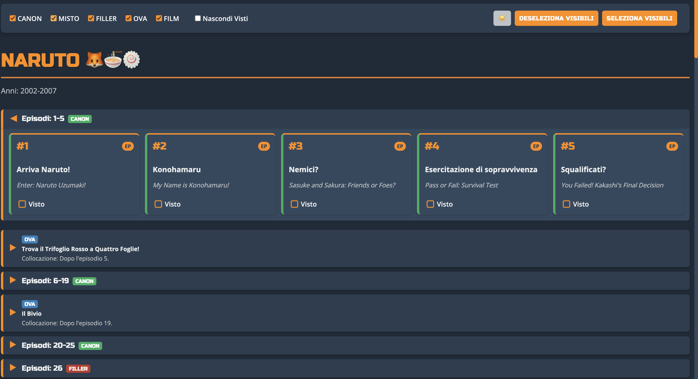

# Naruto Episode Tracker 🦊🍜🍥

Una pagina web per tracciare tutti gli episodi di **Naruto**, **Naruto Shippuden**, OVA e Speciali!  
**Disponibile in italiano e inglese** 🇮🇹🇺🇸

 

## Caratteristiche ✨

- ✅ **Episodi completi**: Include tutti gli episodi di Naruto, Naruto Shippuden, OVA e Speciali
- 📝 **Tracking progresso**: Segna gli episodi come guardati e salva il progresso localmente
- 🔍 **Filtri avanzati**:
  - Cerca per titolo o numero episodio
  - Filtra per tipo (Canon, Filler, Misto, OVA, Speciale)
  - Filtra per saga o arco narrativo
- 🌓 **Modalità chiaro/scuro**: Supporto per temi light/dark automatico
- 📱 **Design responsive**: Funziona su desktop, tablet e mobile

